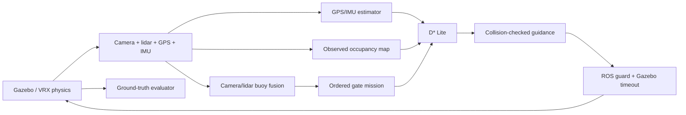

# Njord VRX simulator

A Docker-based ROS 2 Jazzy / Gazebo Harmonic / VRX v3.1.0 simulator for Njord
NTNU's autonomous surface-vessel work. The reference WAM-V uses two RGB cameras
and a 3D lidar to discover red-left/green-right gates, GPS/IMU estimation for
navigation, incremental D* Lite for routes, and force-based differential thrust.

This is a WAM-V reference simulator, not a calibrated digital twin of Njord's
hull. Read [interfaces](docs/interfaces.md) for integration contracts and
[AGENTS.md](AGENTS.md) for engineering and agent collaboration instructions.

A separate, uncalibrated Njord test model is configured through versioned vessel,
scenario and algorithm YAML. See [physical configuration](docs/physical-configuration.md)
for the schema, mesh restrictions, forces and run manifests, and the
[calibration protocol](docs/njord-calibration.md) for isolated dynamics trials.
The [implementation evidence and remaining acceptance](docs/plan-status.md)
distinguish tested behavior from calibration and unsupported extensions.

## Run

Requirements: an x86-64 Ubuntu 24.04 host (or WSL2), Docker Engine with Compose
v2.24 or newer, Git and Python 3. GPU rendering additionally needs the NVIDIA
Container Toolkit and a working NVIDIA host driver. The setup script installs
Docker and the toolkit, **never a GPU kernel driver**.

### New machine

CI publishes a tested image for every commit pushed to GitHub, so a new machine
downloads the image instead of compiling Gazebo and VRX:

```bash
git clone https://github.com/MartinNordli/Surface_Vessel_Simulation.git
cd Surface_Vessel_Simulation
sudo bash scripts/setup-host.sh   # once per machine
./scripts/njord pull              # image CI built and tested for this exact commit
./scripts/njord doctor            # Docker, NVIDIA and image checks
./scripts/njord test              # full test suite in the container
./scripts/njord selftest          # live cameras, lidar and navigation, then stops
./scripts/njord demo
```

`pull` downloads `ghcr.io/martinnordli/surface_vessel_simulation:sha-<commit>`
and tags it `njord-sim:local`; every other command uses that tag. Pull again after
`git pull` or `git checkout`. Commands that use the image compare its baked-in
source digest with the checkout and warn when they differ, for example when an
image is older than the checkout or after local edits to files copied into the
image. `./scripts/njord check-image` performs the same check and fails on a
mismatch. Use `./scripts/njord pull latest` for the newest `main` image, or a
release tag such as `./scripts/njord pull v1.0.0`.

An image exists only after the CI run for that commit has passed. For unpushed
commits or local changes, build instead: `./scripts/njord build`. An uncached
build compiles the Gazebo vendor packages and VRX and takes a long time.

Without a usable GPU, `NJORD_CPU=1` selects Mesa software rendering
(`compose.cpu.yaml`) and skips the NVIDIA checks. It renders the real sensors,
slowly, and is what CI uses; it does not replace a GPU for rendering-performance
or benchmark claims:

```bash
NJORD_CPU=1 ./scripts/njord doctor
NJORD_CPU=1 ./scripts/njord selftest
```

### Continuous integration and delivery

`.github/workflows/ci.yml` runs on every push, tag and fork pull request:

1. `unit` runs the host unit suite without Docker.
2. `image` builds the image with a layer cache in GHCR, confirms that its source
   digest matches the commit, runs `./scripts/njord test` and a CPU-rendered
   `./scripts/njord selftest`, then publishes the image. The tags are
   `sha-<commit>` for every push, `latest` for `main` and the tag name for `v*`
   tags. Pull requests from forks are tested but not published.

Images are only published after the tests pass. CI proves that the image builds,
that the container suite passes and that live sensors and navigation start with
software rendering. CI does not test GPU rendering, race completion or benchmarks.

Docker commands require access to the Docker socket. Use `sudo` or your chosen
Docker group configuration. If group membership was just added, start a fresh
login or use `sg docker -c './scripts/njord demo'` for the existing shell.

`demo` starts simulator, autonomy and evaluator, creates a fresh timestamped
`outputs/run-*` directory, waits for valid perception/planning/navigation and
contact monitoring, then starts race timing. It stops all services on completion
or failure. Exit status is nonzero for a failed race. Generated SDF, URDF, bridge
configuration, resolved scenario and metrics are kept in the output directory.

```bash
./scripts/njord gui                         # Gazebo window
./scripts/njord test                        # CPU + ROS transport/model tests in Docker
./scripts/njord benchmark --jobs 2          # 10 seeds × 2 environments × 2 profiles
./scripts/njord benchmark --dry-run         # inspect matrix without launching
ENVIRONMENT=moderate PROFILE=fast ./scripts/njord demo
```

An optional moderate slalom course adds five alternating gates and five obstacles.
It is a shared test environment for the control/autonomy and perception teams to
compare algorithms and sensor configurations. The reference autonomy is a baseline;
the course does not require that baseline to complete every run successfully.
Build once after adding or changing a scenario: scenarios are copied into the image.
Select the course by name after `demo`, `gui` or `benchmark`:

```bash
./scripts/njord build simulator
./scripts/njord demo slalom
./scripts/njord gui slalom
./scripts/njord gui reference              # switch back to the original course
./scripts/njord demo                       # original reference course remains the default
```

Both courses support the existing `SEED`, `ENVIRONMENT` and `PROFILE` options.
Building just `simulator` updates the shared image used by all three race services.
An explicit course name overrides `SCENARIO` for that invocation. Without a course
name, the existing `SCENARIO` environment variable still works (using a path inside
the container), with the reference course as the default. Additional arguments follow
the course name, for example `./scripts/njord demo slalom recorder` or
`./scripts/njord benchmark slalom --dry-run`. Use `./scripts/njord --help` for usage.

The default simulator uses OGRE2 with headless EGL rendering. NVIDIA graphics
capabilities are supplied to the container. On WSL2, `scripts/njord` automatically
adds `compose.wsl.yaml`, mounting WSLg/DXG and selecting Mesa D3D12 on the NVIDIA
adapter. WSL uses the Windows driver; do not install Linux NVIDIA kernel modules
inside WSL. `nvidia-smi` passing alone does not establish rendering: inspect
Gazebo's `~/.gz/rendering/ogre2.log` and run the live smoke test.

To keep an interactive simulator running and inspect it from another terminal:

```bash
export COMPOSE_FILE=compose.yaml:compose.wsl.yaml  # WSL; native Linux: compose.yaml
export RUN_ID=$(python3 -c 'import uuid; print(uuid.uuid4().hex)')
export OUTPUT_HOST=./outputs/manual-$RUN_ID
docker compose up simulator autonomy evaluator
# Another terminal, same Compose configuration:
./scripts/njord smoke
# Finish:
docker compose down
```

The GUI overlay uses the existing X display and Xauthority; it never runs
`xhost +`. A separate RViz service is available with `docker compose --profile gui up rviz`
using the same Compose files, ROS domain and Gazebo partition as the simulator.

Optional recording (add `compose.wsl.yaml` in the list on WSL):

```bash
COMPOSE_FILE=compose.yaml:compose.record.yaml ./scripts/njord demo recorder
```

This writes compressed MCAP bags under the run directory, including `/clock`,
TF, sensors, navigation, commands and evaluation topics. `recording.json` records
topic selection and image/source provenance. Existing bags are never overwritten.

The project provides `sim_platform`, `perception`, `autonomy` and `validation`
roles under `.codex/agents/`, using the
[documented custom-agent format](https://learn.chatgpt.com/docs/agent-configuration/subagents#custom-agents).
They inherit the parent model and permissions; AGENTS.md defines ownership and
review rules. Ask Codex to delegate an independent task to the relevant role.

## Steg for steg: testing for Control Systems og Perception/CV

Simulatoren tilbyr ROS 2 Jazzy-grensesnitt for egne noder. Kameraene gir RGB og
`CameraInfo`; lidar gir `PointCloud2` og `LaserScan`; GPS/IMU gir rå og
støybehandlede målinger. Estimert odometri og timestampet TF er tilgjengelig.
Dette tester algoritmer mot simulerte sensorer, ikke de fysiske sensorenes
firmware, drivere eller fullstendige optiske egenskaper.

### 1. Bygg og kjør en referanse

Kjør fra roten av dette repositoriet etter vertsoppsettet under «Run»:

```bash
./scripts/njord build simulator
./scripts/njord test
SEED=1 ENVIRONMENT=calm PROFILE=fast ./scripts/njord demo slalom
```

Behold `outputs/run-*/run_metrics.json`, også ved feil. `status`, `gates_passed`,
`collision`, `contact_status` og `time_s` beskriver utfallet. En sensorendring
kan gjøre at referansealgoritmen ikke klarer banen; dette er et testresultat.

### 2. Velg hvilke algoritmer laget skal erstatte

| Innstilling | Referansenoder som utelates | Hva laget leverer |
|---|---|---|
| Ingen valg | Ingen | Hele referansekjeden kjører |
| `CONTROLLER=external` | `guidance` | Venstre/høyre thrust fra egen regulator |
| `PERCEPTION=external` | `perception` | Bøyedeteksjoner fra eget CV/fusjonssystem |
| `MAPPING=external` | `mapper` | Eget occupancy-kart |
| `AUTONOMY=external` | Alle fem: mapper, perception, mission, planner, guidance | Hele algoritmekjeden og tilhørende statusmeldinger |

De tre enkeltvalgene kan kombineres. GPS/IMU-adapter, lokalisering og command
guard kjører i alle tilfeller. `AUTONOMY=external` overstyrer enkeltvalgene.
Dette velger bort referansenoder; det starter ikke lagets pakker automatisk.

### 3. Koble til en egen ROS 2-workspace

Bruk samme `ROS_DOMAIN_ID` (standard 42), meldingsdefinisjoner og Jazzy-versjon.
Alle algoritmenoder skal ha `use_sim_time:=true`. Rå sensorer bruker best-effort
QoS; kontroller og publiserte algoritmeresultater bruker reliable. Topicnavn,
typer og rammer er listet i [docs/interfaces.md](docs/interfaces.md).

På en Linux/WSL-vert med ROS 2 Jazzy kan laget starte nodene direkte:

```bash
source /opt/ros/jazzy/setup.bash
source /sti/til/lagets_ws/install/setup.bash
export ROS_DOMAIN_ID=42
ros2 run <pakkenavn> <node> --ros-args -p use_sim_time:=true
```

Bytt ut plassholderne med deres faktiske pakke og node. Pakker fra andre
ROS-distribusjoner må bygges for Jazzy. Alternativt bygg og kjør inne i
simulatorens image med den medfølgende workspace-overlayen:

```bash
export TEAM_WS_HOST=/absolutt/sti/til/lagets_ws  # workspace med src/
export NJORD_UID=$(id -u) NJORD_GID=$(id -g)
export ROS_DOMAIN_ID=42
# Egen build/install/log hindrer blanding med vertens byggefiler.
docker compose -f compose.yaml -f compose.team.yaml run --rm team \
  colcon --log-base log-sim build --build-base build-sim --install-base install-sim
# Åpne en teamshell; image-entrypoint har allerede sourcet Jazzy og simulatoren.
docker compose -f compose.yaml -f compose.team.yaml run --rm team bash
source /team_ws/install-sim/setup.bash
ros2 run <pakkenavn> <node> --ros-args -p use_sim_time:=true
```

Team-imaget må ha pakkens egne avhengigheter installert; bygg et avledet image
hvis det trengs. Overlayen deler DDS via vertsnettverket og monterer workspace,
men monterer ikke kjøringens `/outputs`. Imaget inneholder eksempelbanene;
algoritmene skal bruke sensorene og ikke lese scenariofasit. For CV som trenger GPU,
legg til passende GPU-oppsett i team-servicen; grunnoppsettet gir ikke team-GPU.

### 4. Test en egen kontrollalgoritme

1. Start lagets controller fra punkt 3. Den må vente på gyldige, ferske input.
2. Start et nytt løp i en annen terminal fra simulatorrepoet:

   ```bash
   CONTROLLER=external SEED=1 ./scripts/njord demo slalom
   ```

3. Abonner på `/njord/path`, `/njord/occupancy` og `/njord/odometry`.
   Publiser `std_msgs/msg/Float64` til begge
   `/njord/thrusters/{left,right}/thrust` i **newton**, normalt ved 20 Hz.
   Det finnes ikke en `cmd_vel`-inngang; en regulator som gir hastighetsønsker
   trenger et eget lag som omsetter dem til fysisk thrust.
4. Kontroller at det bare finnes én publisher for hver thrust-topic:

   ```bash
   docker compose exec simulator /entrypoint.sh ros2 topic info /njord/thrusters/left/thrust --verbose
   docker compose exec simulator /entrypoint.sh ros2 topic echo /njord/race_active --once
   ```

5. Kontrolleren må selv nullstille thrust ved tom/ugyldig/gammel sti, gammelt
   kart eller gammel odometri. Guard krever fersk planner-, mission- og
   navigation-status samt evaluatorens aktive løpssignal. Manglende kommandoer
   i 0,5 s veggklokketid fjerner thrust; båten beholder treghet og kan drive.

En konkret tilkoblingstest uten en egen pakke er å kjøre referansecontrolleren
som separat prosess mens `CONTROLLER=external` brukes:

```bash
docker compose run --rm autonomy ros2 run njord_sim guidance --ros-args \
  -p use_sim_time:=true -p max_speed:=1.0
```

Denne kommandoen skal erstatte lagets controller i testen. Avslutt prosessen
etter løpet før dere starter en annen controller. Den viser ROS-tilkoblingen;
lagets faktiske regulator må testes separat.

### 5. Test eget computer vision eller eget kart

For å undersøke sensorer uten at et løp avsluttes mens dere utvikler:

```bash
AUTONOMY=external ./scripts/njord lab slalom
# En annen terminal:
docker compose exec simulator /entrypoint.sh ros2 topic list
docker compose exec simulator /entrypoint.sh ros2 topic hz \
  /wamv/sensors/cameras/front_left_camera_sensor/image_raw
docker compose exec simulator /entrypoint.sh ros2 topic echo \
  /wamv/sensors/cameras/front_left_camera_sensor/camera_info --once
docker compose exec simulator /entrypoint.sh ros2 topic hz /wamv/sensors/lidars/lidar_wamv_sensor/points
docker compose exec simulator /entrypoint.sh ros2 run tf2_ros tf2_echo map wamv/front_left_camera_link_optical
```

`lab` starter simulator, estimering og valgte referansenoder, uten evaluator.
Stopp tidligere løp først (`docker compose down` med deres Compose-oppsett);
bruk bare én simulator/evaluator per ROS-domene og Gazebo-partisjon. En allerede
kjørende evaluator stoppes ikke av `lab`. Guard holder thrust på null uten
løpssignal fra en evaluator på samme domene. Avslutt med Ctrl-C før et nytt løp.
Dette er en passiv sensortest; vind/bølger kan fortsatt bevege båten. Målte Hz er
mottaksrater i veggklokketid og påvirkes av simulatorens real-time factor.

For å bruke egne CV-resultater i referansemission/planner/controller:

```bash
PERCEPTION=external SEED=1 ./scripts/njord demo slalom
```

Start egen CV-node før løpet. Publiser reliable
`vision_msgs/msg/Detection3DArray` på `/njord/buoys`, i `map` med original
observasjonstid. Bruk stabile, unike `detection.id`, posisjon i
`bbox.center.position`, og `results[].hypothesis.class_id` lik `red` eller
`green` med score minst 0,35. Referansemission krever en behandlet kameraramme
som er høyst 0,5 s gammel. Publiser en tom deteksjonsliste når en **ny behandlet
ramme** ikke inneholder bøyer; ikke gi gamle deteksjoner et nytt tidsstempel.
Deteksjoner i bildekoordinater (`Detection2DArray`) trenger dybde/avstand og
transformasjon til `map` før de kan brukes av denne mission-noden.

En kjørbar erstatningstest er samme separate kommando som for controller,
men med `ros2 run njord_sim perception --ros-args -p use_sim_time:=true`.
For et eget kart brukes `MAPPING=external`; publiser `nav_msgs/msg/OccupancyGrid`
på `/njord/occupancy` med `map`-ramme, gyldig geometri og cellene -1 ukjent,
0 observert fri og 100 opptatt/inflatert. Behold ukjent som ukjent.

### 6. Endre sensorer og algoritmeparametere uten å bygge på nytt

Med standard montering er `njord_sim/config/` på verten tilgjengelig som
`/config` inne i containerne. Et medfølgende eksempel reduserer kameraene til
320×180/10 Hz og lidar til 360×8/5 Hz, GPS til 5 Hz og IMU til 50 Hz:

```bash
VESSEL_CONFIG=/config/sensors_low_bandwidth.yaml SEED=1 ./scripts/njord lab slalom
# Eller et komplett løp:
VESSEL_CONFIG=/config/sensors_low_bandwidth.yaml SEED=1 ./scripts/njord demo slalom
```

Lagets egne filer kan ligge i en separat mappe:

```bash
mkdir -p outputs/team-config
cp njord_sim/config/sensors_low_bandwidth.yaml outputs/team-config/sensors.yaml
cp njord_sim/config/team_example.yaml outputs/team-config/algorithms.yaml
# Rediger filene, og start et nytt løp:
CONFIG_HOST="$PWD/outputs/team-config" \
VESSEL_CONFIG=/config/sensors.yaml ROS_PARAMS_FILE=/config/algorithms.yaml \
SEED=1 ENVIRONMENT=calm PROFILE=fast ./scripts/njord demo slalom
```

Sensorfilen er en delvis overstyring av `vessel.yaml`. Den støtter oppløsning,
felles kamerarate, horisontalt synsfelt i radianer, kamera-/lidarstøy,
lidarrekkevidde og antall stråler, GPS-/IMU-rate og GPS-/IMU-orienteringsstøy.
Ukjente feltnavn og ugyldige tall avvises. Innstillingene gjelder begge kameraer.
Sensorplassering og rotasjon endres i `sensors.xacro`; dette krever
`./scripts/njord build simulator`, slik at URDF/TF og fysisk modell oppdateres
sammen. Nye sensortyper krever modell, bridge og eventuelle adaptere; en vilkårlig
sensor støttes ikke bare ved å legge et navn i YAML.

Algoritmefilen bruker vanlig ROS 2-format med nodenavn og `ros__parameters`, se
`team_example.yaml`. Den overstyrer standardparametere og `PROFILE` for nodene
simulatorens autonomy-launch starter. `use_sim_time` holdes alltid aktivert.
Eksterne noder får sine parametere gjennom egne launch-filer eller
`--params-file /config/algorithms.yaml`. `max_thrust_n` setter kraftgrensen;
`thruster_separation_m` endrer regulatorens miksing, ikke plasseringen av VRX-motorene.

Simulatoren lagrer den ferdige sensorkonfigurasjonen i
`outputs/run-*/vessel_config.yaml`. Sensoradapter og guard bruker denne samme
kopien. Algoritmeparametere kopieres til `ros_params.yaml` når de er valgt;
`autonomy_config.json` lagrer valg, argumenter og SHA256-fingeravtrykk.
Eksterne pakker må i tillegg arkivere egen commit, parametere og avhengigheter.

### 7. Ta opp og sammenlign forsøk

```bash
# Native Linux; på WSL legg til :compose.wsl.yaml i COMPOSE_FILE.
COMPOSE_FILE=compose.yaml:compose.record.yaml \
VESSEL_CONFIG=/config/sensors_low_bandwidth.yaml \
SEED=1 ./scripts/njord demo slalom recorder
# Sensoropptak uten løp, til dere trykker Ctrl-C:
COMPOSE_FILE=compose.yaml:compose.record.yaml \
AUTONOMY=external ./scripts/njord lab slalom recorder
```

MCAP-bagen ligger i den nye run-mappen. Se innholdet og spill sensorer tilbake
med simulatoren stoppet, gjerne i et eget ROS-domene. Eksempel fra repoet:

```bash
export OUTPUT_HOST="$PWD/outputs/run-SETT-INN-RIKTIG-MAPPE"
ROS_DOMAIN_ID=43 docker compose run --rm autonomy ros2 bag info /outputs/bag
ROS_DOMAIN_ID=43 docker compose run --rm autonomy ros2 bag play /outputs/bag \
  --clock --topics /tf /tf_static /njord/odometry \
  /wamv/sensors/cameras/front_left_camera_sensor/image_raw \
  /wamv/sensors/cameras/front_left_camera_sensor/camera_info \
  /wamv/sensors/cameras/front_right_camera_sensor/image_raw \
  /wamv/sensors/cameras/front_right_camera_sensor/camera_info \
  /wamv/sensors/lidars/lidar_wamv_sensor/points
unset OUTPUT_HOST
```

Start CV-noden med domene 43 og `use_sim_time:=true`. Ved avspilling skal bare
spilleren gi `/clock`. Listen velger sensorer/TF/odometri for offline CV og
unngår duplisering av innspilte CV-resultater. Avspilling påvirkes ikke fysisk
av nye kontrollkommandoer; controller-sammenligning krever nye simulerte løp.

Sammenlign konfigurasjoner med samme bane, seed, miljø og profil, og forskjellige
outputmapper. Referansekjeden kan kjøres som en repeterbar matrise:

```bash
VESSEL_CONFIG=/config/vessel.yaml ./scripts/njord benchmark slalom \
  --seeds 1 2 3 --environments calm
VESSEL_CONFIG=/config/sensors_low_bandwidth.yaml ./scripts/njord benchmark slalom \
  --seeds 1 2 3 --environments calm
```

Benchmark velger egne ROS-domener per jobb. Eksterne noder kobles derfor ikke
automatisk til disse; bruk enkeltløp som over, eller integrer teamstart i hver
benchmark-jobb før ekstern parallelltesting. Behold alle feil og timeouts når
resultatene sammenlignes. CPU-/ROS-tester beviser ikke GPU-rendering eller
kollisjonsfri fullføring for en ny konfigurasjon.

## Data flow



The scenario file is the only source of world/evaluator obstacle geometry.
Autonomy receives the gate count through an atomic, run-specific startup manifest,
never the hidden coordinates. Output directories containing a prior run are rejected. Both cameras
have calibrated optical frames, and pointcloud transforms use their acquisition
time with full roll/pitch/yaw. Free ray observations and aged occupancy replace
the old permanent obstacle map. Unknown cells remain explicitly unknown; the
route planner may explore through them, but the controller only advances into
an observed-free corridor.

## Configuration

- `scenarios/reference.yaml`: three 14 m-wide gates, two additional obstacles,
  starting pose, seed, timeout and calm/moderate wind/wave presets. JSON syntax is
  valid YAML; general YAML is accepted too. Scenario generation saves resolved
  geometry and a SHA256 digest per run.
- `scenarios/slalom.yaml`: five 14 m-wide gates with centres alternating between
  y=0 and y=5 m and forward normals alternating ±10° from east. Five 0.8 m-radius
  obstacles flank the route, with room for the existing clearance-limited controller.
  Seeded gate offsets are ±0.5 m; the simulation timeout is 480 s. It uses the
  reference start pose, vessel and calm/moderate environments and fits within the
  existing map. The ordered gates create the slalom; obstacles do not all force
  additional detours on the nominal route.
- `njord_sim/config/vessel.yaml` and `sensors.xacro`: sensor geometry, rates,
  resolution and noise, thruster limits. Defaults: 640×360 RGB at 15 Hz, 720×16
  lidar at 10 Hz/80 m, GPS 10 Hz, IMU 100 Hz. WAM-V thruster separation 2.05427 m.
- `njord_sim/config/localization.yaml`: local attitude EKF, global GPS/IMU EKF,
  and local-cartesian GPS conversion. No ground-truth odometry enters these nodes.
- `PROFILE=conservative|fast`: speed ceilings 1.0 and 2.0 m/s, respectively,
  reduced by heading error, clearance and available stopping corridor. Thrust
  limit 500 N per engine. Initial braking assumption 0.25 m/s² must be checked
  through dynamics experiments before transferring parameters to another boat.

Harmonic's NavSat implementation applies horizontal noise in **degrees**. We
therefore disable that built-in noise and add independently seeded metric noise
in the GPS adapter, using WGS84 curvature to convert metres to latitude/longitude.
Default horizontal standard deviation 0.3 m and vertical 0.5 m. IMU attitude noise
is 0.005 rad; angular-rate and acceleration noise remain the upstream sensor model.

The mission initializes its first search from estimated heading. A gate leaving
the camera field of view may be remembered for at most 45 s inside a bounded
15 m approach/crossing corridor; fresh camera frames, odometry and observed-free
lidar guidance are still required. Mapping inflates obstacles by 4 m.

The command guard requires current planner, mission, navigation and evaluator
heartbeats. Commands expire after 0.5 seconds of steady time. A separate Gazebo
plugin removes thrust if the ROS guard or bridge disappears. Zero thrust leaves
momentum and wind drift; it is not an instant stop or a collision guarantee.

## Validation

```bash
python3 tests/test_dstar_lite.py
python3 -m unittest discover -s tests -p 'test_*.py'
./scripts/njord test
./scripts/njord selftest    # NJORD_CPU=1 without a usable GPU
```

CPU tests cover independent A* comparisons, incremental obstacle repair, invalid
endpoints, complete grid geometry, observed-free tracking, map clearing/aging,
full 3D sensor transforms, camera color detection, lidar association, ordered gates,
collision scoring, strict metrics and benchmark comparisons. ROS/model tests
explicitly skip when their dependencies are absent on the host; run the container
suite for the full check. Transport tests run in isolated ROS domains.

Team integration regressions cover all eight controller/perception/mapping
combinations, full external mode, parameter precedence, configuration snapshots,
invalid settings and generation of a customized WAM-V sensor model. On
2026-09-10 the container suite passed all 119 tests. A live lab smoke test with
`sensors_low_bandwidth.yaml` received both 320×180 camera streams, finite lidar
returns, estimated odometry and optical TF; the lab remained running after the
inspection process exited. This verifies the tested sensor configuration and
ROS connection, not race completion or the team's unpublished algorithms.

Slalom regressions check seeds 1–10 for unambiguous ordered gate selection,
camera-to-buoy sightlines at start and gate exits, alternating turns and traversable routes
with the existing 4 m inflation. The offline checks use complete scenario geometry;
they do not establish live perception or physical completion. Run the six calm-water
slalom races with both speed profiles using:

```bash
./scripts/njord benchmark slalom --seeds 1 2 3 --environments calm
```

Initial live checks in calm conditions completed all five slalom gates with the
fast profile on seeds 1 and 2, with measured contact monitoring and no collisions.
The conservative baseline can stop when a slow gate approach or crossing exhausts
the 45 s remembered-gate window. Retain these failures when comparing algorithms;
completion across all profiles, seeds and sensor configurations is not established.

`sandbox/headless_demo.py` runs the planner core closed loop against a 3-DOF
vessel and a simulated 2D lidar, with no ROS and no Gazebo. Five seeds take about
ten seconds and exit nonzero if any seed fails to reach the goal or collides. It
tests planner, inflation and guidance parameters, not hydrodynamics, rendering or
ROS integration. `sandbox/make_gif.py` animates the same run. Both write to
`outputs/sandbox/`; the committed figures in `sandbox/` are illustrations and are
not regenerated by a run.

`validation/check_runtime.py` checks actual camera pixels, finite lidar returns,
GPS/IMU odometry and optical TF against a running simulator. Benchmark acceptance
requires every reference run to finish the ordered course with no contact and no
geometric overlap, verified contact monitoring, and a faster median for the fast
profile on matched seeds. Reports retain failures, timeouts and unavailable data.
Seeds improve repeatability; GPU rendering is not promised to be bit deterministic.

Run dynamics measurements with **only the simulator service** running:

```bash
export RUN_ID=$(python3 -c 'import uuid; print(uuid.uuid4().hex)')
export OUTPUT_HOST=./outputs/dynamics-$RUN_ID
export SCENARIO=/opt/njord/scenarios/dynamics.yaml
docker compose up simulator
# A second terminal with the same environment:
docker compose run --rm autonomy python3 validation/check_dynamics.py --ros-args -p use_sim_time:=true
```

The script is the sole force-envelope publisher for this experiment. It measures
straight-line acceleration/top speed, turning speed/yaw rate/radius, and coast
arc length. An unfinished stop is reported explicitly. Use a clear scenario for
these open-loop manoeuvres. Lidar validation accepts a known cylindrical target
and measures range from the actual sensor origin using a separate truth TF buffer.

## Limits and next vessel integration

The stock hydrodynamics are a reference, not Njord measurements. Buoys are fixed
vertical cylinders approximating moored markers. The camera baseline assumes
colored gates and undistorted images; it is not a general learned detector.
Lidar's no-return scan supplement assumes obstacles intersect its sensing volume;
very short objects, spray, sun glare and physical water optics need further work.
Moving-traffic behavior, currents, COLREGs and global time-optimal control are not
implemented. D* Lite minimizes geometric grid distance; the two speed profiles
provide a measurable timing comparison, not a proof of a fastest possible route.

For the real vessel, replace the model/configuration, sensor extrinsics and
actuator mapping; calibrate mass/inertia, drag, thrust curves, turn response and
stopping behaviour against measurements; then repeat the validation ladder.

## Reproducibility and attribution

Docker pins the ROS base image digest, VRX commit and Gazebo vendor source
commits in `docker/dependencies.lock.json`. `scripts/lock-dependencies.py` is an
explicit maintenance command, not part of normal builds. Ubuntu/ROS apt package
repositories still receive updates; preserve the built image ID for exact binary
reproduction. Builds through `scripts/njord build` bake the source commit and a SHA256 of Docker
source inputs into the image, including dirty source changes; CI-published images
carry the same metadata. The digest counts only the executable bit of each file,
as Git does, so clones made with different umasks agree. Benchmarks pin the
immutable image ID and record its source metadata separately from the runner Git
commit and dirty state. Direct Docker builds without these arguments report unknown
source provenance.

The Docker base setup derives from the Apache-2.0 licensed
[VRX v3.1.0 container setup](https://github.com/osrf/vrx/tree/v3.1.0/docker),
including its SDFormat/Python vendor compatibility approach. WAM-V assets and VRX
plugins retain upstream licenses. The adapted Docker setup retains the
[VRX Apache-2.0 license](docker/LICENSE.vrx). See [VRX](https://github.com/osrf/vrx) and
[Gazebo EGL rendering](https://gazebosim.org/api/sim/8/headless_rendering.html).
