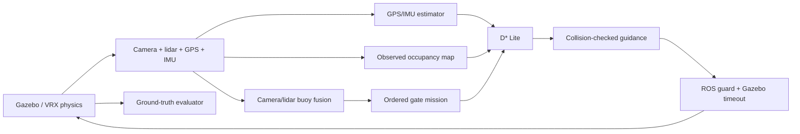

# Njord VRX simulator

A Docker-based ROS 2 Jazzy / Gazebo Harmonic / VRX v3.1.0 simulator for Njord
NTNU's autonomous surface-vessel work. The reference WAM-V uses two RGB cameras
and a 3D lidar to discover red-left/green-right gates, GPS/IMU estimation for
navigation, incremental D* Lite for routes, and force-based differential thrust.

This is a WAM-V reference simulator, not a calibrated digital twin of Njord's
hull. Read [interfaces](docs/interfaces.md) for integration contracts and
[AGENTS.md](AGENTS.md) for engineering and agent collaboration instructions.

## Run

Requirements: Ubuntu 24.04, Docker Engine with Compose v2, NVIDIA Container
Toolkit, and a working NVIDIA host driver. The setup script installs Docker and
the toolkit, **never a GPU kernel driver**:

```bash
sudo bash scripts/setup-host.sh
./scripts/njord build
./scripts/njord doctor
./scripts/njord demo
```

Docker commands require access to the Docker socket. Use `sudo` or your chosen
Docker group configuration. If group membership was just added, start a fresh
login or use `sg docker -c './scripts/njord demo'` for the existing shell.

`demo` starts simulator, autonomy and evaluator, creates a fresh timestamped
`outputs/run-*` directory, waits for valid perception/planning/navigation and
contact monitoring, then starts race timing. It stops all services on completion
or failure. Exit status is nonzero for a failed race. Generated SDF, URDF, bridge
configuration, resolved scenario and metrics are kept in the output directory.

```bash
./scripts/njord gui                         # Gazebo window
./scripts/njord test                        # CPU + ROS transport/model tests in Docker
./scripts/njord benchmark --jobs 2          # 10 seeds × 2 environments × 2 profiles
./scripts/njord benchmark --dry-run         # inspect matrix without launching
ENVIRONMENT=moderate PROFILE=fast ./scripts/njord demo
```

An optional moderate slalom course adds five alternating gates and five obstacles.
It is a shared test environment for the control/autonomy and perception teams to
compare algorithms and sensor configurations. The reference autonomy is a baseline;
the course does not require that baseline to complete every run successfully.
Build once after adding or changing a scenario: scenarios are copied into the image.
Select the course for one invocation with `SCENARIO` (the path is inside the container):

```bash
./scripts/njord build simulator
SCENARIO=/opt/njord/scenarios/slalom.yaml ./scripts/njord demo
SCENARIO=/opt/njord/scenarios/slalom.yaml ./scripts/njord gui
./scripts/njord demo                       # original reference course remains the default
```

Both courses support the existing `SEED`, `ENVIRONMENT` and `PROFILE` options.
Building just `simulator` updates the shared image used by all three race services.
If `SCENARIO` was exported in your shell, explicitly select
`SCENARIO=/opt/njord/scenarios/reference.yaml` to return to the reference course.

The default simulator uses OGRE2 with headless EGL rendering. NVIDIA graphics
capabilities are supplied to the container. On WSL2, `scripts/njord` automatically
adds `compose.wsl.yaml`, mounting WSLg/DXG and selecting Mesa D3D12 on the NVIDIA
adapter. WSL uses the Windows driver; do not install Linux NVIDIA kernel modules
inside WSL. `nvidia-smi` passing alone does not establish rendering: inspect
Gazebo's `~/.gz/rendering/ogre2.log` and run the live smoke test.

To keep an interactive simulator running and inspect it from another terminal:

```bash
export COMPOSE_FILE=compose.yaml:compose.wsl.yaml  # WSL; native Linux: compose.yaml
export RUN_ID=$(python3 -c 'import uuid; print(uuid.uuid4().hex)')
export OUTPUT_HOST=./outputs/manual-$RUN_ID
docker compose up simulator autonomy evaluator
# Another terminal, same Compose configuration:
./scripts/njord smoke
# Finish:
docker compose down
```

The GUI overlay uses the existing X display and Xauthority; it never runs
`xhost +`. A separate RViz service is available with `docker compose --profile gui up rviz`
using the same Compose files, ROS domain and Gazebo partition as the simulator.

Optional recording (add `compose.wsl.yaml` in the list on WSL):

```bash
COMPOSE_FILE=compose.yaml:compose.record.yaml ./scripts/njord demo recorder
```

This writes compressed MCAP bags under the run directory, including `/clock`,
TF, sensors, navigation, commands and evaluation topics. `recording.json` records
topic selection and image/source provenance. Existing bags are never overwritten.

The project provides `sim_platform`, `perception`, `autonomy` and `validation`
roles under `.codex/agents/`, using the
[documented custom-agent format](https://learn.chatgpt.com/docs/agent-configuration/subagents#custom-agents).
They inherit the parent model and permissions; AGENTS.md defines ownership and
review rules. Ask Codex to delegate an independent task to the relevant role.

## Data flow



The scenario file is the only source of world/evaluator obstacle geometry.
Autonomy receives the gate count through an atomic, run-specific startup manifest,
never the hidden coordinates. Output directories containing a prior run are rejected. Both cameras
have calibrated optical frames, and pointcloud transforms use their acquisition
time with full roll/pitch/yaw. Free ray observations and aged occupancy replace
the old permanent obstacle map. Unknown cells remain explicitly unknown; the
route planner may explore through them, but the controller only advances into
an observed-free corridor.

## Configuration

- `scenarios/reference.yaml`: three 14 m-wide gates, two additional obstacles,
  starting pose, seed, timeout and calm/moderate wind/wave presets. JSON syntax is
  valid YAML; general YAML is accepted too. Scenario generation saves resolved
  geometry and a SHA256 digest per run.
- `scenarios/slalom.yaml`: five 14 m-wide gates with centres alternating between
  y=0 and y=5 m and forward normals alternating ±10° from east. Five 0.8 m-radius
  obstacles flank the route, with room for the existing clearance-limited controller.
  Seeded gate offsets are ±0.5 m; the simulation timeout is 480 s. It uses the
  reference start pose, vessel and calm/moderate environments and fits within the
  existing map. The ordered gates create the slalom; obstacles do not all force
  additional detours on the nominal route.
- `njord_sim/config/vessel.yaml` and `sensors.xacro`: sensor geometry, rates,
  resolution and noise, thruster limits. Defaults: 640×360 RGB at 15 Hz, 720×16
  lidar at 10 Hz/80 m, GPS 10 Hz, IMU 100 Hz. WAM-V thruster separation 2.05427 m.
- `njord_sim/config/localization.yaml`: local attitude EKF, global GPS/IMU EKF,
  and local-cartesian GPS conversion. No ground-truth odometry enters these nodes.
- `PROFILE=conservative|fast`: speed ceilings 1.0 and 2.0 m/s, respectively,
  reduced by heading error, clearance and available stopping corridor. Thrust
  limit 500 N per engine. Initial braking assumption 0.25 m/s² must be checked
  through dynamics experiments before transferring parameters to another boat.

Harmonic's NavSat implementation applies horizontal noise in **degrees**. We
therefore disable that built-in noise and add independently seeded metric noise
in the GPS adapter, using WGS84 curvature to convert metres to latitude/longitude.
Default horizontal standard deviation 0.3 m and vertical 0.5 m. IMU attitude noise
is 0.005 rad; angular-rate and acceleration noise remain the upstream sensor model.

The mission initializes its first search from estimated heading. A gate leaving
the camera field of view may be remembered for at most 45 s inside a bounded
15 m approach/crossing corridor; fresh camera frames, odometry and observed-free
lidar guidance are still required. Mapping inflates obstacles by 4 m.

The command guard requires current planner, mission, navigation and evaluator
heartbeats. Commands expire after 0.5 seconds of steady time. A separate Gazebo
plugin removes thrust if the ROS guard or bridge disappears. Zero thrust leaves
momentum and wind drift; it is not an instant stop or a collision guarantee.

## Validation

```bash
python3 tests/test_dstar_lite.py
python3 -m unittest discover -s tests -p 'test_*.py'
./scripts/njord test
```

CPU tests cover independent A* comparisons, incremental obstacle repair, invalid
endpoints, complete grid geometry, observed-free tracking, map clearing/aging,
full 3D sensor transforms, camera color detection, lidar association, ordered gates,
collision scoring, strict metrics and benchmark comparisons. ROS/model tests
explicitly skip when their dependencies are absent on the host; run the container
suite for the full check. Transport tests run in isolated ROS domains.

Slalom regressions check seeds 1–10 for unambiguous ordered gate selection,
camera-to-buoy sightlines at start and gate exits, alternating turns and traversable routes
with the existing 4 m inflation. The offline checks use complete scenario geometry;
they do not establish live perception or physical completion. Run the six calm-water
slalom races with both speed profiles using:

```bash
SCENARIO=/opt/njord/scenarios/slalom.yaml ./scripts/njord benchmark --seeds 1 2 3 --environments calm
```

Initial live checks in calm conditions completed all five slalom gates with the
fast profile on seeds 1 and 2, with measured contact monitoring and no collisions.
The conservative baseline can stop when a slow gate approach or crossing exhausts
the 45 s remembered-gate window. Retain these failures when comparing algorithms;
completion across all profiles, seeds and sensor configurations is not established.

`sandbox/headless_demo.py` runs the planner core closed loop against a 3-DOF
vessel and a simulated 2D lidar, with no ROS and no Gazebo. Five seeds take about
ten seconds and exit nonzero if any seed fails to reach the goal or collides. It
tests planner, inflation and guidance parameters, not hydrodynamics, rendering or
ROS integration. `sandbox/make_gif.py` animates the same run. Both write to
`outputs/sandbox/`; the committed figures in `sandbox/` are illustrations and are
not regenerated by a run.

`validation/check_runtime.py` checks actual camera pixels, finite lidar returns,
GPS/IMU odometry and optical TF against a running simulator. Benchmark acceptance
requires every reference run to finish the ordered course with no contact and no
geometric overlap, verified contact monitoring, and a faster median for the fast
profile on matched seeds. Reports retain failures, timeouts and unavailable data.
Seeds improve repeatability; GPU rendering is not promised to be bit deterministic.

Run dynamics measurements with **only the simulator service** running:

```bash
export RUN_ID=$(python3 -c 'import uuid; print(uuid.uuid4().hex)')
export OUTPUT_HOST=./outputs/dynamics-$RUN_ID
export SCENARIO=/opt/njord/scenarios/dynamics.yaml
docker compose up simulator
# A second terminal with the same environment:
docker compose run --rm autonomy python3 validation/check_dynamics.py --ros-args -p use_sim_time:=true
```

The script is the sole force-envelope publisher for this experiment. It measures
straight-line acceleration/top speed, turning speed/yaw rate/radius, and coast
arc length. An unfinished stop is reported explicitly. Use a clear scenario for
these open-loop manoeuvres. Lidar validation accepts a known cylindrical target
and measures range from the actual sensor origin using a separate truth TF buffer.

## Limits and next vessel integration

The stock hydrodynamics are a reference, not Njord measurements. Buoys are fixed
vertical cylinders approximating moored markers. The camera baseline assumes
colored gates and undistorted images; it is not a general learned detector.
Lidar's no-return scan supplement assumes obstacles intersect its sensing volume;
very short objects, spray, sun glare and physical water optics need further work.
Moving-traffic behavior, currents, COLREGs and global time-optimal control are not
implemented. D* Lite minimizes geometric grid distance; the two speed profiles
provide a measurable timing comparison, not a proof of a fastest possible route.

For the real vessel, replace the model/configuration, sensor extrinsics and
actuator mapping; calibrate mass/inertia, drag, thrust curves, turn response and
stopping behaviour against measurements; then repeat the validation ladder.

## Reproducibility and attribution

Docker pins the ROS base image digest, VRX commit and Gazebo vendor source
commits in `docker/dependencies.lock.json`. `scripts/lock-dependencies.py` is an
explicit maintenance command, not part of normal builds. Ubuntu/ROS apt package
repositories still receive updates; preserve the built image ID for exact binary
reproduction. Builds through `scripts/njord build` bake the source commit and a SHA256 of Docker
source inputs into the image, including dirty source changes. Benchmarks pin the
immutable image ID and record its source metadata separately from the runner Git
commit and dirty state. Direct Docker builds without these arguments report unknown
source provenance.

The Docker base setup derives from the Apache-2.0 licensed
[VRX v3.1.0 container setup](https://github.com/osrf/vrx/tree/v3.1.0/docker),
including its SDFormat/Python vendor compatibility approach. WAM-V assets and VRX
plugins retain upstream licenses. The adapted Docker setup retains the
[VRX Apache-2.0 license](docker/LICENSE.vrx). See [VRX](https://github.com/osrf/vrx) and
[Gazebo EGL rendering](https://gazebosim.org/api/sim/8/headless_rendering.html).
