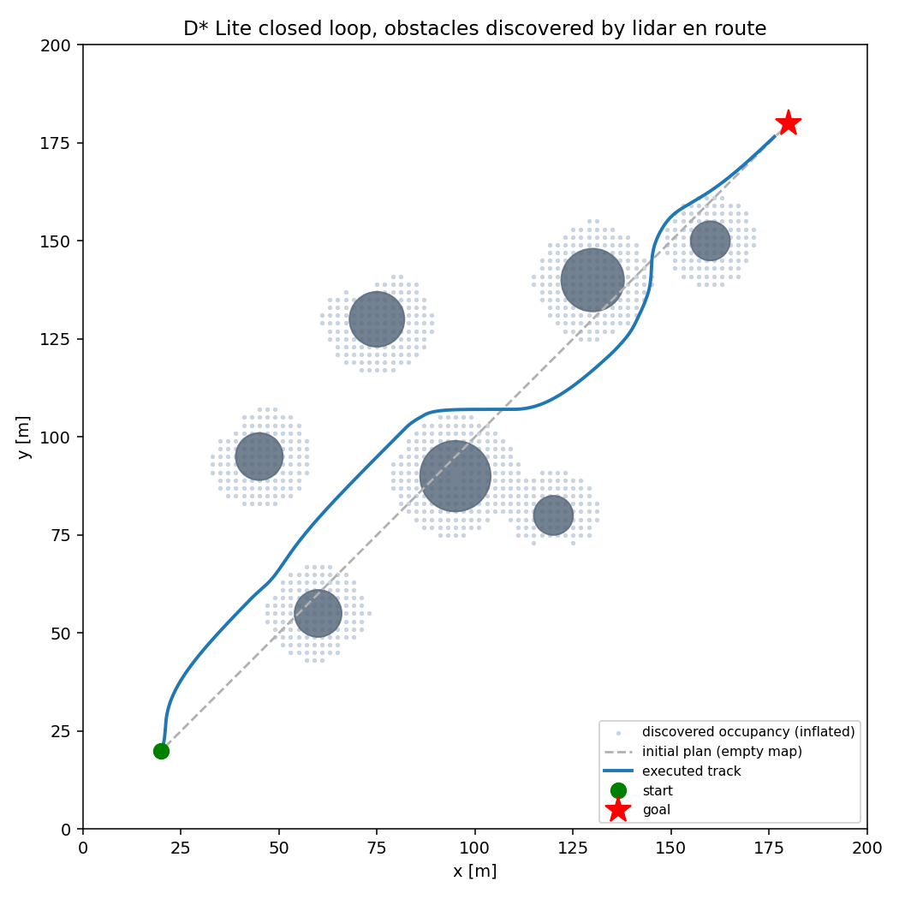

<div align="center">

# Njord VRX Simulator

**A containerized autonomous surface vessel simulator for Njord NTNU**

[](https://github.com/MartinNordli/Surface_Vessel_Simulation/actions/workflows/ci.yml)


</div>

A WAM-V in Gazebo races through red-left/green-right buoy gates using only its own
sensors. The full autonomy stack runs out of the box, and the Control Systems and
Perception teams can swap in their own ROS 2 nodes to test them against the same
courses, seeds and metrics.

<p align="center">
  
  <br><sub>D* Lite replanning around obstacles as the lidar discovers them (headless sandbox)</sub>
</p>

## Features

- **Perception**: two RGB cameras and a 3D lidar fused into red/green buoy detections
- **Navigation**: GPS/IMU EKF estimation, observed occupancy mapping and incremental D* Lite planning
- **Control**: collision-checked guidance with force-based differential thrust behind a command guard and watchdog
- **Evaluation**: ground-truth race evaluator, contact monitoring and repeatable seeded benchmarks
- **Team integration**: replace the controller, perception, mapping or the whole autonomy chain with your own nodes
- **Reproducible**: pinned dependencies, and every commit gets a tested image on GHCR

> [!NOTE]
> This is a WAM-V **reference** simulator, not a calibrated digital twin of Njord's
> hull. A separate, uncalibrated Njord physics model is available through
> [versioned YAML configuration](docs/physical-configuration.md).

## Quick start

Requires an x86-64 Ubuntu 24.04 host or WSL2. A GPU is optional.

```bash
git clone https://github.com/MartinNordli/Surface_Vessel_Simulation.git
cd Surface_Vessel_Simulation
sudo bash scripts/setup-host.sh   # once per machine: Docker + NVIDIA Container Toolkit
./scripts/njord pull              # download the CI-tested image for this commit
./scripts/njord doctor            # check Docker, GPU and image
./scripts/njord selftest          # verify live cameras, lidar and navigation
./scripts/njord demo              # run a race
```

No usable GPU? Prefix commands with `NJORD_CPU=1` for software rendering.
Working on unpushed changes? Use `./scripts/njord build` instead of `pull`.

## Usage

```bash
./scripts/njord demo slalom                              # headless race, results in outputs/run-*
./scripts/njord gui slalom                               # same race with Gazebo and RViz
SEED=2 ENVIRONMENT=moderate PROFILE=fast ./scripts/njord demo
./scripts/njord benchmark slalom --seeds 1 2 3           # seeded comparison matrix
./scripts/njord test                                     # full test suite in the container
```

| Course | Layout |
|---|---|
| `reference` (default) | 3 gates, 2 obstacles |
| `slalom` | 5 alternating gates, 5 obstacles |

Every run writes metrics, the resolved scenario and generated models to a fresh
`outputs/run-*` directory.

## Testing your own algorithms

Leave out reference nodes and connect your own over ROS 2 (domain 42, `use_sim_time`):

```bash
CONTROLLER=external ./scripts/njord demo slalom   # publish left/right thrust in newtons
PERCEPTION=external ./scripts/njord demo slalom   # publish buoy detections
MAPPING=external    ./scripts/njord demo slalom   # publish an occupancy grid
AUTONOMY=external   ./scripts/njord lab slalom    # sensors only, no race
```

Sensor resolution, rates and noise can be changed via YAML without rebuilding.
See the [team integration guide](docs/team-integration.md) for the full walkthrough.

## Documentation

| Guide | Contents |
|---|---|
| [Running](docs/running.md) | Commands, courses, rendering, WSL, recording and CI/CD |
| [Team integration](docs/team-integration.md) | Step-by-step for Control Systems and Perception/CV |
| [Interfaces](docs/interfaces.md) | ROS topics, message types, frames and node ownership |
| [Architecture](docs/architecture.md) | Data flow, configuration, safety, limits and reproducibility |
| [Validation](docs/validation.md) | Test coverage, benchmarks and dynamics measurements |
| [Physical configuration](docs/physical-configuration.md) | Versioned vessel, scenario and algorithm YAML |
| [Njord calibration](docs/njord-calibration.md) | Calibration protocol for the Njord model |
| [AGENTS.md](AGENTS.md) | Engineering rules and contributor workflow |

## Project structure

```
njord_sim/          ROS 2 package: nodes, launch files and configuration
njord_gz_plugins/   Gazebo plugins: actuator watchdog and contact monitor
scenarios/          Course definitions
scripts/            njord CLI, host setup, benchmark and run tooling
validation/         Live runtime and dynamics checks
tests/              Unit and integration tests
sandbox/            Headless planner demo without ROS or Gazebo
docker/             Image dependencies, lock file and entrypoint
```

## Acknowledgements

Built on [VRX](https://github.com/osrf/vrx) and
[Gazebo](https://gazebosim.org/). The Docker setup derives from the Apache-2.0
licensed [VRX v3.1.0 container setup](https://github.com/osrf/vrx/tree/v3.1.0/docker)
and retains its [license](docker/LICENSE.vrx). WAM-V assets and VRX plugins keep
their upstream licenses.
