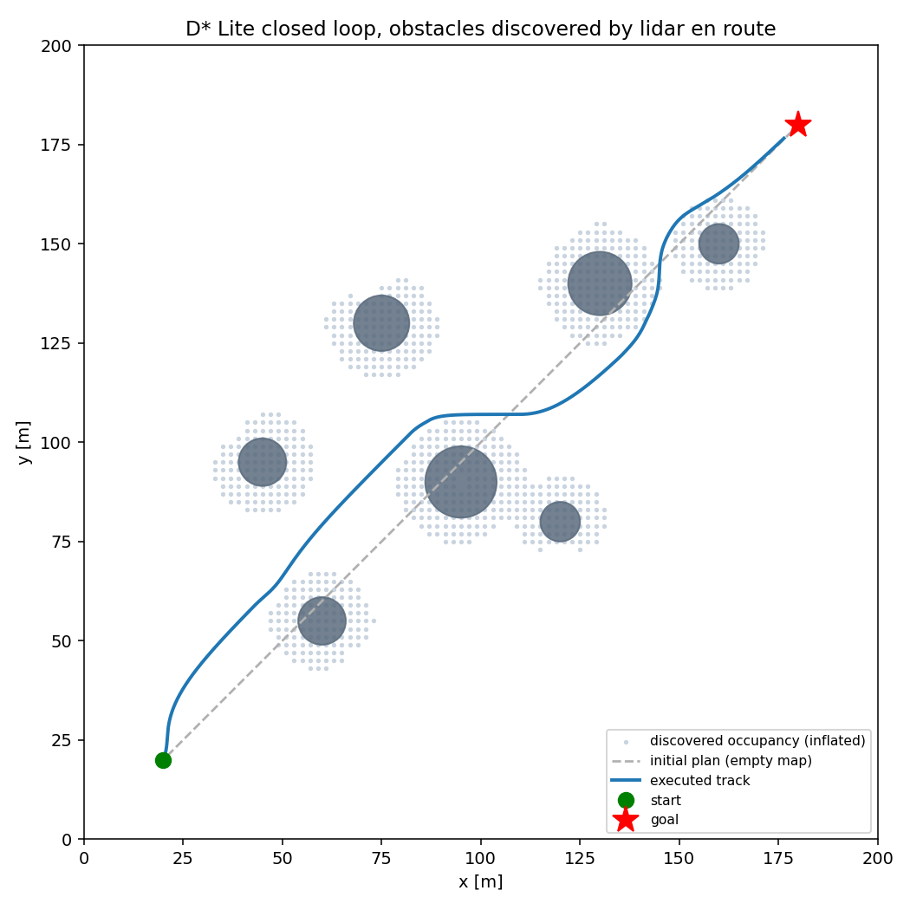

<div align="center">

# Njord VRX Simulator

**A containerized autonomous surface vessel simulator for Njord NTNU**

[](https://github.com/MartinNordli/Surface_Vessel_Simulation/actions/workflows/ci.yml)


</div>

A boat in Gazebo races through red-left/green-right buoy gates using only its
own sensors. The full autonomy stack runs out of the box, and the Control
Systems and Perception teams can swap in their own ROS 2 nodes to test them
against the same courses, seeds and metrics before going on the water.

<p align="center">
  
  <br><sub>D* Lite replanning around obstacles as the lidar discovers them (headless sandbox)</sub>
</p>

## Features

- **Perception**: two RGB cameras and a 3D lidar fused into red/green buoy detections
- **Navigation**: GPS/IMU EKF estimation, observed occupancy mapping and incremental D* Lite planning
- **Control**: collision-checked guidance with force-based differential thrust behind a command guard and watchdog
- **Evaluation**: ground-truth race evaluator, contact monitoring and repeatable seeded benchmarks
- **Team integration**: replace the controller, perception, mapping or the whole autonomy chain with your own nodes
- **One place per setting**: each vessel, course and tuning set is a single YAML file, validated before start
- **Reproducible**: pinned dependencies, and every commit gets a tested image on GHCR

> [!NOTE]
> The default vessel is the VRX **WAM-V reference**, not a calibrated digital
> twin of Njord. A separate, **uncalibrated** Njord physics model is available
> as its own vessel file; see [configuration](docs/configuration.md).

## Quick start

Requires an x86-64 Ubuntu 24.04 host or WSL2. A GPU is optional.

```bash
git clone https://github.com/MartinNordli/Surface_Vessel_Simulation.git
cd Surface_Vessel_Simulation
sudo bash scripts/setup-host.sh   # once per machine: Docker + NVIDIA Container Toolkit
./scripts/njord pull              # download the CI-tested image for this commit
./scripts/njord doctor            # check Docker, GPU and image
./scripts/njord selftest          # verify live cameras, lidar and navigation
./scripts/njord demo              # run a race
```

No usable GPU? Prefix commands with `NJORD_CPU=1` for software rendering.
Working on unpushed changes? Use `./scripts/njord build` instead of `pull`.

## Usage

```bash
./scripts/njord demo slalom                              # headless race, results in outputs/run-*
./scripts/njord gui slalom                               # same race with Gazebo and RViz
SEED=2 ENVIRONMENT=moderate PROFILE=conservative ./scripts/njord demo
./scripts/njord benchmark slalom --seeds 1 2 3           # seeded comparison matrix
./scripts/njord test                                     # full test suite in the container
./scripts/njord help                                     # all commands and courses
```

| Course | Layout |
|---|---|
| `reference` (default) | 3 gates, 2 obstacles |
| `slalom` | 5 alternating gates, 5 obstacles |
| `dynamics` | open water for dynamics measurements |

A course is a file in `scenarios/`; add a file there to add a course. Every run
writes metrics, the resolved configuration and generated models to a fresh
`outputs/run-*` directory.

## Where to change settings

Each setting lives in exactly one file. Edit it and start a new run; files
under `njord_sim/config/` are mounted into the containers, so no rebuild is
needed.

| To change | Edit | Select with |
|---|---|---|
| WAM-V sensors (resolution, rate, range, noise) and thrust limit | `njord_sim/config/vessels/wamv.yaml` | default vessel |
| The Njord boat (geometry, mass, damping, thrusters, sensors) | `njord_sim/config/vessels/njord_v1.yaml` | `VESSEL_CONFIG=/config/vessels/njord_v1.yaml` |
| Four-thruster Munin placeholder (assumed layout, uncalibrated) | `njord_sim/config/vessels/munin_v0.yaml` | `VESSEL_CONFIG=/config/vessels/munin_v0.yaml` |
| Gates, obstacles, start pose, time limit, wind/waves/current | `scenarios/<course>.yaml` | course name, `ENVIRONMENT` |
| Speed profiles, guidance gains, planner and map tuning | `njord_sim/config/algorithms.yaml` | `PROFILE` |
| Fixed platform constants (GPS datum, command timeout) | `njord_sim/njord_sim/constants.py` | rebuild |

The full table, file formats and parameter precedence are in
[docs/configuration.md](docs/configuration.md).

## Testing your own algorithms

Leave out reference nodes and connect your own over ROS 2 (domain 42, `use_sim_time`):

```bash
CONTROLLER=external ./scripts/njord demo slalom   # publish /thruster_<i>/command in newtons
PERCEPTION=external ./scripts/njord demo slalom   # publish buoy detections
MAPPING=external    ./scripts/njord demo slalom   # publish an occupancy grid
AUTONOMY=external   ./scripts/njord lab slalom    # sensors only, no race
```

See the [team integration guide](docs/team-integration.md) for the full
walkthrough and [interfaces](docs/interfaces.md) for every topic and frame.

## Documentation

| Guide | Contents |
|---|---|
| [Running](docs/running.md) | Commands, courses, rendering, WSL, recording and CI/CD |
| [Configuration](docs/configuration.md) | Where every setting lives; vessel, scenario and algorithm files |
| [Team integration](docs/team-integration.md) | Step-by-step for Control Systems and Perception/CV |
| [Interfaces](docs/interfaces.md) | ROS topics, message types, frames and node ownership |
| [Architecture](docs/architecture.md) | Data flow, run lifecycle, code map, safety and limits |
| [Validation](docs/validation.md) | Test coverage, benchmarks and dynamics measurements |
| [Njord calibration](docs/njord-calibration.md) | Calibration protocol for the Njord model |
| [Njord model evidence](docs/njord-model-evidence.md) | What the Njord physics model implements and how it was verified |
| [Platform choice](docs/simulatorplattform-vrx-vs-pygemini.md) | Why VRX/Gazebo (Norwegian) |
| [AGENTS.md](AGENTS.md) | Engineering rules and contributor workflow |

## Project structure

```
njord_sim/                  ROS 2 package
  config/                   algorithms.yaml, localization.yaml, RViz layout
    vessels/                one file per vessel: wamv.yaml (default), njord_v1.yaml
    examples/               partial sensor override, ROS parameter file
  launch/                   simulator and autonomy launch files
  njord_sim/                nodes (*_node.py), ROS-free cores (*_core.py), configuration
njord_gz_plugins/           C++ Gazebo plugins: actuator watchdog, Njord physics, contacts
scenarios/                  course files
scripts/                    njord CLI, host setup, benchmark and run tooling
tests/                      unit and integration tests
validation/                 live runtime and dynamics checks
sandbox/                    headless planner demo without ROS or Gazebo
docker/                     image dependencies, lock file and entrypoint
docs/                       guides listed above
```

## Contributing

Work on a branch (`git checkout -b feat/<topic>`), keep changes small and run
the checks for the area you touched. [AGENTS.md](AGENTS.md) holds the
engineering rules and [docs/agent-workflows.md](docs/agent-workflows.md) the
verification per change area. The quick loop without Docker:

```bash
python3 tests/test_dstar_lite.py
python3 -m unittest discover -s tests -p 'test_*.py'
```

`./scripts/njord test` runs the complete suite, including ROS and Gazebo model
tests, inside the container. CI runs the same commands on every push.

## Acknowledgements

Built on [VRX](https://github.com/osrf/vrx) and
[Gazebo](https://gazebosim.org/). The Docker setup derives from the Apache-2.0
licensed [VRX v3.1.0 container setup](https://github.com/osrf/vrx/tree/v3.1.0/docker)
and retains its [license](docker/LICENSE.vrx). WAM-V assets and VRX plugins keep
their upstream licenses.
