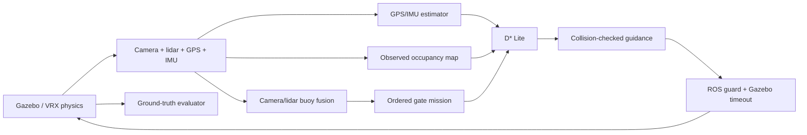

# Architecture and configuration

## Data flow

The scenario file is the only source of world and evaluator obstacle geometry.
Autonomy receives the gate count through an atomic, run-specific startup manifest,
never the hidden coordinates. Output directories containing a prior run are
rejected.

Both cameras have calibrated optical frames, and pointcloud transforms use their
acquisition time with full roll/pitch/yaw. Free ray observations and aged occupancy
replace the old permanent obstacle map. Unknown cells remain explicitly unknown;
the route planner may explore through them, but the controller only advances into
an observed-free corridor.

## Configuration

- `scenarios/reference.yaml`: three 14 m-wide gates, two additional obstacles,
  starting pose, seed, timeout and calm/moderate wind/wave presets. JSON syntax is
  valid YAML; general YAML is accepted too. Scenario generation saves resolved
  geometry and a SHA256 digest per run.
- `scenarios/slalom.yaml`: five 14 m-wide gates with centres alternating between
  y=0 and y=5 m and forward normals alternating ±10° from east. Five 0.8 m-radius
  obstacles flank the route, with room for the existing clearance-limited
  controller. Seeded gate offsets are ±0.5 m; the simulation timeout is 480 s. It
  uses the reference start pose, vessel and calm/moderate environments and fits
  within the existing map. The ordered gates create the slalom; obstacles do not
  all force additional detours on the nominal route.
- `njord_sim/config/vessel.yaml` and `sensors.xacro`: sensor geometry, rates,
  resolution and noise, thruster limits. Defaults: 640×360 RGB at 15 Hz, 720×16
  lidar at 10 Hz/80 m, GPS 10 Hz, IMU 100 Hz. WAM-V thruster separation 2.05427 m.
- `njord_sim/config/localization.yaml`: local attitude EKF, global GPS/IMU EKF,
  and local-cartesian GPS conversion. No ground-truth odometry enters these nodes.
- `PROFILE=conservative|fast`: speed ceilings of 1.0 and 2.0 m/s, reduced by
  heading error, clearance and available stopping corridor. Thrust limit 500 N per
  engine. The initial braking assumption of 0.25 m/s² must be checked through
  dynamics experiments before transferring parameters to another boat.

The versioned Njord vessel, scenario and algorithm schema is described in
[physical-configuration.md](physical-configuration.md).

## Sensor noise

Harmonic's NavSat implementation applies horizontal noise in **degrees**. The
built-in noise is therefore disabled, and the GPS adapter adds independently
seeded metric noise, using WGS84 curvature to convert metres to latitude and
longitude. Default standard deviation is 0.3 m horizontal and 0.5 m vertical. IMU
attitude noise is 0.005 rad; angular-rate and acceleration noise remain the
upstream sensor model.

## Mission and safety

The mission initializes its first search from the estimated heading. A gate
leaving the camera field of view may be remembered for at most 45 s inside a
bounded 15 m approach/crossing corridor; fresh camera frames, odometry and
observed-free lidar guidance are still required. Mapping inflates obstacles by 4 m.

The command guard requires current planner, mission, navigation and evaluator
heartbeats. Commands expire after 0.5 s of steady time. A separate Gazebo plugin
removes thrust if the ROS guard or bridge disappears. Zero thrust leaves momentum
and wind drift; it is not an instant stop or a collision guarantee.

## Limits and next vessel integration

The stock hydrodynamics are a reference, not Njord measurements. Buoys are fixed
vertical cylinders approximating moored markers. The camera baseline assumes
colored gates and undistorted images; it is not a general learned detector.
The lidar's no-return scan supplement assumes obstacles intersect its sensing
volume; very short objects, spray, sun glare and physical water optics need
further work. Moving traffic, currents, COLREGs and global time-optimal control
are not implemented. D* Lite minimizes geometric grid distance; the two speed
profiles provide a measurable timing comparison, not proof of the fastest
possible route.

For the real vessel, replace the model/configuration, sensor extrinsics and
actuator mapping; calibrate mass/inertia, drag, thrust curves, turn response and
stopping behaviour against measurements; then repeat the validation ladder.

## Reproducibility

Docker pins the ROS base image digest, VRX commit and Gazebo vendor source commits
in `docker/dependencies.lock.json`. `scripts/lock-dependencies.py` is an explicit
maintenance command, not part of normal builds. Ubuntu/ROS apt repositories still
receive updates; preserve the built image ID for exact binary reproduction.

Builds through `scripts/njord build` bake the source commit and a SHA256 of Docker
source inputs into the image, including dirty source changes; CI-published images
carry the same metadata. The digest counts only the executable bit of each file,
as Git does, so clones made with different umasks agree. Benchmarks pin the
immutable image ID and record its source metadata separately from the runner Git
commit and dirty state. Direct Docker builds without these arguments report
unknown source provenance.
