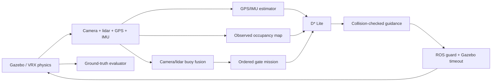

# Architecture

## Data flow

```mermaid
flowchart LR
  G[Gazebo / VRX physics] --> S[Camera + lidar + GPS + IMU]
  S --> E[GPS/IMU estimator]
  S --> P[Camera/lidar buoy fusion]
  S --> M[Observed occupancy map]
  P --> Q[Ordered gate mission]
  E --> D[D* Lite]
  M --> D
  Q --> D
  D --> C[Collision-checked guidance]
  C --> W[ROS guard + Gazebo timeout]
  W --> G
  G --> V[Ground-truth evaluator]
```

The autonomy only sees sensors. The scenario file is the only source of gate
and obstacle geometry, and only world generation and the evaluator read it; the
autonomy learns how many gates there are, never where.

Both cameras have calibrated optical frames, and point clouds are transformed
with TF at their acquisition time, with full roll/pitch/yaw. The map keeps
unknown, observed-free and occupied cells distinct and ages out old
observations. The route planner may explore through unknown cells, but the
controller only advances into an observed-free corridor.

## Run lifecycle

`./scripts/njord demo` starts three Compose services from the same image:

1. **`scripts/njord`** pins the image ID, creates a unique `RUN_ID` and a fresh
   `outputs/run-*` directory.
2. **simulator** (`launch/simulation.launch.py`) resolves the vessel, scenario
   and algorithm files into one validated configuration, freezes checksummed
   copies, generates the vessel model, world and bridge files, writes
   `public_parameters.json` and `run_manifest.json`, and atomically publishes
   `run_ready.json`. Only then does it start Gazebo, spawn the vessel and start
   the bridges.
3. **autonomy** (`scripts/run_autonomy.py`) waits for `run_ready.json` with the
   matching run ID, verifies the manifest, records its own settings in
   `autonomy_config.json` and starts `launch/dstar_demo.launch.py` with the
   public parameters.
4. **evaluator** (`scripts/run_evaluator.py` → `evaluator_node.py`) waits for
   the same handoff, starts the race once navigation, mission, planner and
   contact monitoring are healthy, scores it against ground truth and writes
   `run_metrics.json`. Its exit code (0 = completed) ends the run.

## Code map

`njord_sim/njord_sim/` follows one rule: `*_core.py` (and the other plain
modules) are pure Python and testable without ROS; `*_node.py` only connects
them to topics, parameters and timers.

| Area | Module | Role |
| --- | --- | --- |
| Configuration | `configuration.py` | Loads and validates the three YAML files into one resolved configuration |
| | `constants.py` | Fixed platform constants (world origin, command timeout, WAM-V geometry) |
| | `defaults.py` | Fallback node parameters, read from the configuration files |
| Model and world | `vessel.py` | WAM-V model from the VRX xacro, sensor settings and bridges |
| | `njord_model.py`, `mesh_geometry.py`, `physics_core.py` | Njord model generation, convex mesh import, reference force calculations |
| | `scenario.py` | World SDF: buoys, obstacles, water, wind and waves |
| | `run_manifest.py` | Atomic, checksummed handoff between the services |
| Scoring | `scenario_core.py`, `evaluator_node.py` | Gate crossing, clearance and race status from ground truth |
| Estimation | `sensor_adapter_node.py` | GPS/IMU noise and the navigation health heartbeat |
| | `truth_relay_node.py` | Explicit truth mode: ground truth as `/njord/odometry` and TF |
| Perception | `perception_core.py`, `perception_node.py` | Colour blobs + lidar depth → buoy tracks |
| Mapping | `mapping_core.py`, `mapper_node.py` | Ray-traced occupancy grid with aging and inflation |
| Planning | `dstar_lite.py`, `planner_core.py`, `planner_node.py` | Incremental D* Lite on the occupancy grid |
| Mission | `mission_node.py` | Ordered red-left/green-right gate sequence → goals |
| Control | `control_core.py`, `guidance_node.py` | Line-of-sight tracking, speed limits, thrust allocation |
| Safety | `command_guard_node.py` | Single actuator authority; zero thrust on stale inputs |
| Shared | `geometry.py` | Rigid transforms and timestamp helpers |

Gazebo plugins in `njord_gz_plugins/`: `ActuatorWatchdog` (WAM-V thrust with a
simulation-time timeout and a steady-time liveness limit), `NjordPhysics` (Njord hydrostatics, wind and thrusters)
and `ContactMonitor` (contact heartbeat so silence never means "no contact").

## Configuration

Where each setting lives, how files are selected and how parameters take
precedence is described in [configuration.md](configuration.md).

## Sensor noise

Harmonic's NavSat implementation applies horizontal noise in **degrees**. The
built-in noise is therefore disabled, and the sensor adapter adds independently
seeded metric noise, using WGS84 curvature to convert metres to latitude and
longitude. IMU attitude noise is added the same way; angular-rate and
acceleration noise remain the upstream sensor model. The noise levels are set
per vessel in its vessel file.

## Mission and safety

The mission initializes its first search from the estimated heading. A gate
leaving the camera field of view may be remembered for a limited time inside a
bounded approach/crossing corridor; fresh camera frames, odometry and
observed-free lidar guidance are still required.

The command guard requires current planner, mission, navigation and evaluator
heartbeats. Commands and heartbeats expire after `COMMAND_TIMEOUT_S` (0.5 s) of
simulation time, so a command acts on the boat for the same simulated time at
any real-time factor; `PROCESS_LIVENESS_S` (2 s) of steady time only catches a
stopped `/clock` or a dead process. The guard forwards each complete set of
thruster commands as it arrives, without a rate of its own. A separate Gazebo
plugin applies the same two limits and removes thrust if the ROS guard or
bridge disappears.
Zero thrust leaves momentum and wind drift; it is not an instant stop or a
collision guarantee.

## Limits and next vessel integration

The WAM-V hydrodynamics are the VRX reference, not Njord measurements, and the
Njord model is uncalibrated. Buoys are fixed vertical cylinders approximating
moored markers. The camera baseline assumes coloured gates and undistorted
images; it is not a general learned detector. The lidar's no-return scan
supplement assumes obstacles intersect its sensing volume; very short objects,
spray, sun glare and physical water optics need further work. Water current is
modelled for the Njord vessel only. Moving traffic, COLREGs and global
time-optimal control are not implemented. D* Lite minimizes geometric grid
distance; the two speed profiles give a measurable timing comparison, not proof
of the fastest possible route.

For the real vessel, replace the model configuration, sensor extrinsics and
actuator mapping; calibrate mass/inertia, drag, thrust curves, turn response and
stopping behaviour against measurements ([njord-calibration.md](njord-calibration.md));
then repeat the validation ladder.

## Reproducibility

Docker pins the ROS base image digest, VRX commit and Gazebo vendor source commits
in `docker/dependencies.lock.json`. `scripts/lock-dependencies.py` is an explicit
maintenance command, not part of normal builds. Ubuntu/ROS apt repositories still
receive updates; preserve the built image ID for exact binary reproduction.

Builds through `scripts/njord build` bake the source commit and a SHA256 of Docker
source inputs into the image, including dirty source changes; CI-published images
carry the same metadata. The digest counts only the executable bit of each file,
as Git does, so clones made with different umasks agree. Benchmarks pin the
immutable image ID and record its source metadata separately from the runner Git
commit and dirty state. Direct Docker builds without these arguments report
unknown source provenance.
