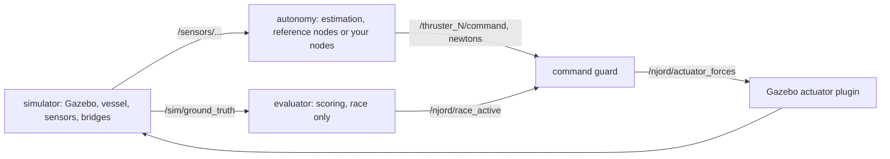

# How a run fits together

A one-page map for someone new to the simulator. Details are in the linked
documents; this page only explains how the pieces connect.

## One run, three inputs

Every run is defined by three YAML files, each with one owner
([configuration](configuration.md)):

| File | What it decides |
| --- | --- |
| vessel file (`VESSEL_CONFIG`) | the boat: hull, mass, thrusters, sensors |
| scenario (`scenarios/<course>.yaml`) | the world: gates, obstacles, start, wind and current |
| `algorithms.yaml` (`ALGORITHMS_CONFIG`) | the reference autonomy's tuning |

Run options such as `SEED`, `PROFILE`, `REAL_TIME_FACTOR` and `RUN_MODE` are
environment variables. The simulator validates everything before Gazebo starts
and writes the result, with checksums, into a fresh `outputs/run-*` directory
(`resolved_configuration.json`, `run_manifest.json`). Only then does it publish
`run_ready.json`, the handoff the other processes wait for. A run can therefore
always be traced back to the exact inputs and image that produced it.

## The processes

- **simulator** runs Gazebo with the vessel and course and bridges its sensors
  to ROS under `/sensors/...`. Ground truth goes to `/sim/...`, which only the
  evaluator (and explicit truth mode) may use.
- **autonomy** always runs state estimation and the command guard. The
  reference mapper, perception, mission, planner and guidance run unless a
  team replaces them (`AUTONOMY`, `CONTROLLER`, `PERCEPTION`, `MAPPING` =
  `external`; see [team integration](team-integration.md)).
- **evaluator** runs the race (`demo`, `gui`, `benchmark`). It starts the race,
  scores it against ground truth and writes `run_metrics.json`, `timeseries.csv`
  and `report.html`. On a setpoint course it is also the referee that issues the
  target poses on `/njord/setpoint` one at a time
  ([control-autonomy-setpoints.md](control-autonomy-setpoints.md)). In `lab`
  (`RUN_MODE=free`) it only observes: the boat can simply be driven, and targets
  sent with `./scripts/njord goto` are scored until Ctrl-C.

## The path of a thrust command

1. A controller publishes one force in newtons per thruster on
   `/<thruster name>/command`, e.g. `/thruster_1/command`.
2. The **command guard** is the only way to the thrusters. It forwards a
   complete set of commands as soon as they arrive, and sends zero instead
   while anything it requires is missing or stale: every thruster's command,
   the navigation heartbeat, the planner and mission (or setpoint controller)
   heartbeats when those reference nodes run, and in a race the evaluator's
   race-active signal.
3. The **Gazebo plugin** applies the forces and repeats the same freshness
   check, so a dead guard or bridge also stops the thrust.
4. Zero thrust is not a brake: the boat keeps its momentum and drifts.

When the boat does not move, read `/njord/guard_status`: it names the input
that blocks thrust.

## Two clocks

- **Simulation time** (`/clock`) is what the algorithms, the scoring and data
  freshness use. A command is stale 0.5 s of simulation time after it
  arrived, whatever the real-time factor.
- **Steady wall time** is used only by watchdogs that notice a stopped
  simulator or a dead process (2 s), and by the overall wall budget of a run.

Nothing is ever re-stamped to look fresh. Because computation takes real time,
only runs near real-time factor 1 represent the boat's computation latency
([configuration](configuration.md#real-time-factor-and-computation-time)).

## What autonomy may and may not see

Autonomy works from sensors only: cameras, lidar, GPS and IMU with their
noise, and the estimator's odometry. It knows how many gates a course has, not
where they are. Scenario geometry and `/sim/...` are for world generation and
scoring. `STATE_SOURCE=truth` is the one explicit exception, for testing a
controller without estimation errors, and it is recorded in the results.

## Where results go

Each run writes its directory under `outputs/` (git-ignored): the frozen
inputs, `run_metrics.json` from the evaluator and, if recorded, a ROS bag.
Summaries that documentation cites are kept in [`docs/evidence/`](evidence/).
See [running](running.md) for commands and [interfaces](interfaces.md) for
every topic and frame.
